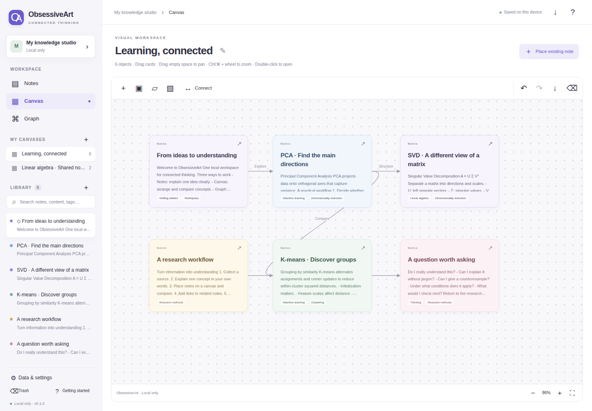
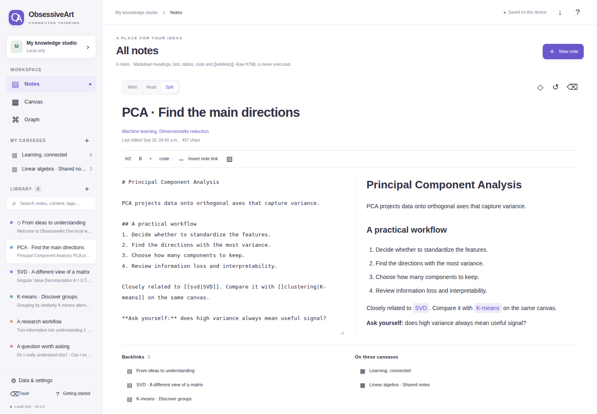
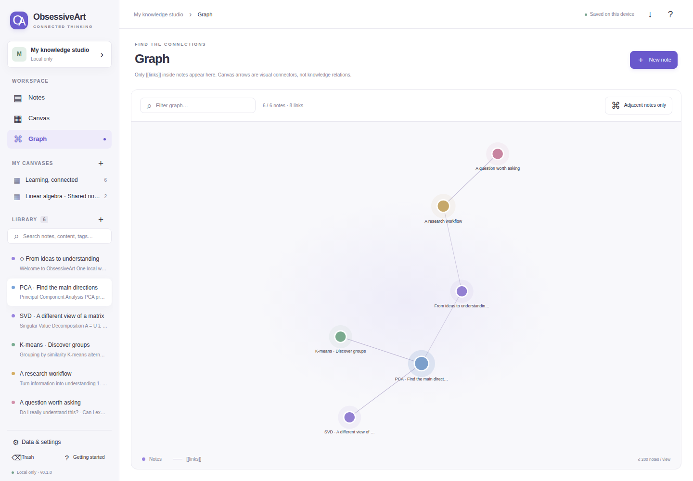
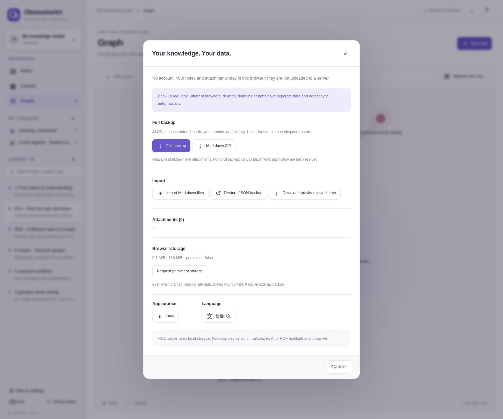
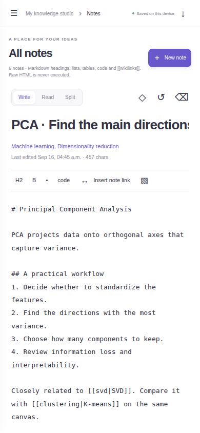

# ObsessiveArt

**Linked notes. Visual canvases. A knowledge graph. One local workspace.**

[Open the web app](https://jacbus1.github.io/ObsessiveArt/) · [繁體中文](README.zh-Hant.md) · [Deployment status](https://github.com/jacbus1/ObsessiveArt/actions/workflows/pages.yml) · [Architecture](docs/ARCHITECTURE.md) · [Security](SECURITY.md)

ObsessiveArt is an independently implemented, single-user knowledge workspace inspired by the workflows of Obsidian, Miro and Heptabase. It is not affiliated with those products and does not include their proprietary code.

## Try it in your browser

Open **[jacbus1.github.io/ObsessiveArt](https://jacbus1.github.io/ObsessiveArt/)**. No installation, account, API key or external database is needed. The public host serves the application; each visitor has a separate browser-local workspace.

Double-click the sample **PCA** card, change its text, then switch to the second canvas. The same note appears there with the updated content and an independent position. Reload to check persistence. Use **Data & settings → Full backup** before storing important information.

The initial sample notes are in Traditional Chinese. Switch the interface to English in **Data & settings → Language**. Changing interface language does not translate your notes.

## Feature tour

These are **real Chromium screenshots**, not design mockups. They were captured in fresh, disposable browser profiles using fictional demonstration content. The English sample was translated and imported through the application's normal JSON restore interface. See the [capture script](tools/capture_readme.py) and [image provenance and checksums](docs/screenshots/capture.json). The Chinese README has separate Chinese screenshots.

### Visual canvas — arrange ideas without duplicating notes

Drag and resize cards, pan and zoom, select multiple objects, add sticky notes and frames, and connect objects with labeled arrows. A note can appear on several canvases. Removing one placement does not delete its note.



### Note editor — write, read and connect

Write Markdown or use the split editor and preview. Add tags and internal links, inspect backlinks, and see which canvases reference the current note. Use stable-ID link insertion when a link must survive renaming.



### Knowledge graph — explore actual note links

The graph is derived from links inside notes, not decorative canvas arrows. Filter by text or tags, focus on adjacent notes, and click a node to open its note. A view renders at most 200 notes.



### Backup and restore — keep a portable copy

Download a full JSON backup containing notes, canvases, attachments and history. Restore a backup only after saving the current workspace. Markdown ZIP is a readable export, not a full-fidelity backup.



### Mobile-sized editor — read and edit on a narrow screen

The interface adapts to a small viewport. This is a **390 × 844 Chromium viewport**, not proof of physical-device or Safari compatibility.



## What works in v0.1.0

| Area | Implemented |
|---|---|
| Notes | Markdown write/read/split modes, tags, pinning, search, wikilinks, backlinks, 25 editing-session snapshots, trash and restore |
| Canvas | Multiple canvases, shared note placements, drag/resize, pan/zoom, multi-select/box-select, sticky notes, frames, labeled connectors, image/PDF attachments, structural undo/redo and SVG export |
| Graph | Note-link relationships, filtering, adjacent-note view and clickable notes |
| Data | IndexedDB transactions, stale-writer rejection, previous-commit recovery copy, full JSON backup/restore, previewed Markdown import, Markdown/attachment ZIP export and offline app-shell caching |
| Interface | English/Traditional Chinese, light/dark appearance and responsive editing |

Images can be displayed. PDF attachments can be downloaded, but their text and highlights are not parsed. Raw HTML in Markdown is escaped, not executed.

## Run locally

Install Node.js 22 or newer, then:

```sh
git clone https://github.com/jacbus1/ObsessiveArt.git
cd ObsessiveArt
npm start
```

Open **http://localhost:4173**. There is no `npm install` step. Do not double-click `index.html`; use a web origin. Use the same URL, port and browser on subsequent visits.

## Important data boundaries

**Your content stays in this browser.** Publishing source code or hosting this application does not upload or back up your notes. This version has no note-upload API, analytics, runtime CDN libraries or AI calls. It does not provide application-level encryption.

Browser storage is not an external backup. Clearing site data, private browsing, a different browser/domain/port, or device failure can make content unavailable. Download and verify full JSON backups regularly. Moving from localhost to the public website requires explicit backup export and restore.

A stale tab is prevented from silently overwriting newer data. Saving pauses and the app offers a backup: export unsaved work before reloading. This is **not real-time multiplayer or cross-device synchronization**.

## Scope and release status

This is a usable **single-user v0.1.0**, not complete product parity or an enterprise production certification. Account permissions, multiplayer, cloud sync, AI, OCR, freehand drawing, complete PDF reading/highlight anchors, arbitrary rich-text blocks and lossless Miro/Heptabase imports are not implemented.

Canvas Undo is in-memory structural history and resets on text editing to avoid reverting newer text through an old canvas snapshot. Text inputs use native browser Undo; History provides longer-term text recovery. A frame moves fully enclosed cards, not a persistent parent/child group.

Safety limits: 5,000 notes, 150 canvases, 5,000 total canvas objects, 200 attachments, 8 MiB per attachment, 250,000 characters per note, 16 MiB total text/history and 40 MiB native backup. These are **not verified scale/performance promises**. See [release notes](docs/RELEASE.md).

## Tests and deployment

```sh
npm run check
npm test
npm run build
# Keep npm start running in another terminal:
python -m pip install playwright==1.57.0
python -m playwright install chromium
python tests/browser_test.py
# Recreate the documentation screenshots:
python tools/capture_readme.py
```

CI checks syntax, runs domain/security tests, builds the static site and executes real Chromium tests covering reload persistence, stale-write rejection, backup restore and offline reload. Read the [actual Actions results](https://github.com/jacbus1/ObsessiveArt/actions); configuration alone is not proof that tests passed.

The Pages workflow automatically runs on relevant application and deployment-file changes pushed to `main`; manual dispatch is also available. It tests the application before publication, deploys `dist/`, and checks the published HTML and core module over HTTP. These HTTP checks are not a full browser test against the public website.

For a fork, enable **Settings → Pages → Source → GitHub Actions** once. Other static HTTPS hosts can also serve `dist/`. The public host serves code; each visitor has their own browser-local workspace.

The screenshot workflow publishes only generated files under `docs/screenshots/`, using synthetic sample content. Screenshots demonstrate features; they are not performance or security certification.

The service worker updates after old app tabs close: save first, close all app tabs and reopen. Do not clear site storage just to update the app.

## License

Original application code: MIT. No third-party runtime dependencies or bundled font files. GitHub Actions and optional testing tools retain their own licenses. See [LICENSE](LICENSE) and [THIRD_PARTY_NOTICES.md](THIRD_PARTY_NOTICES.md).
