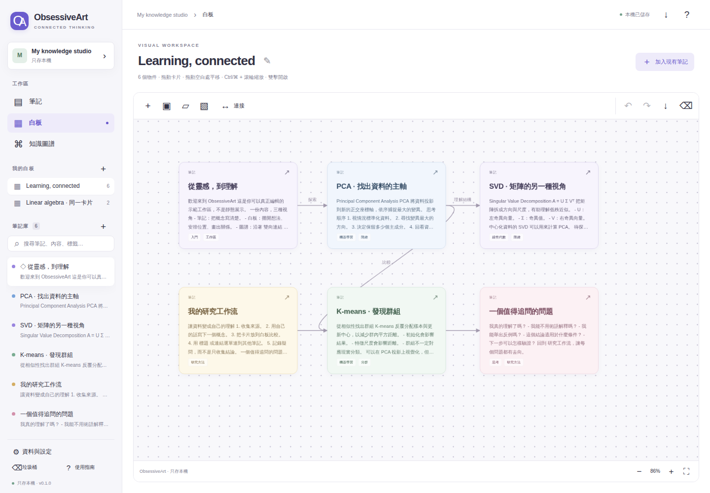
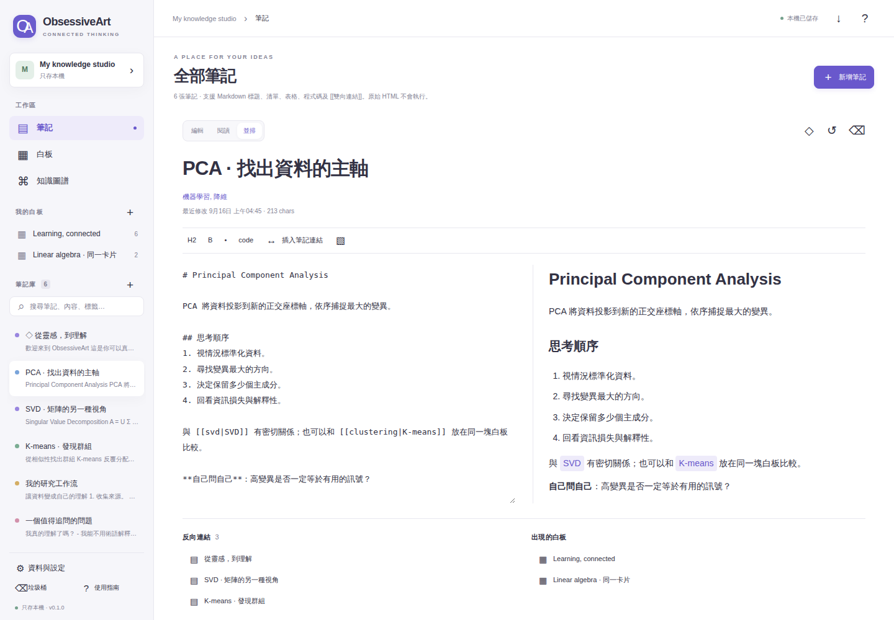
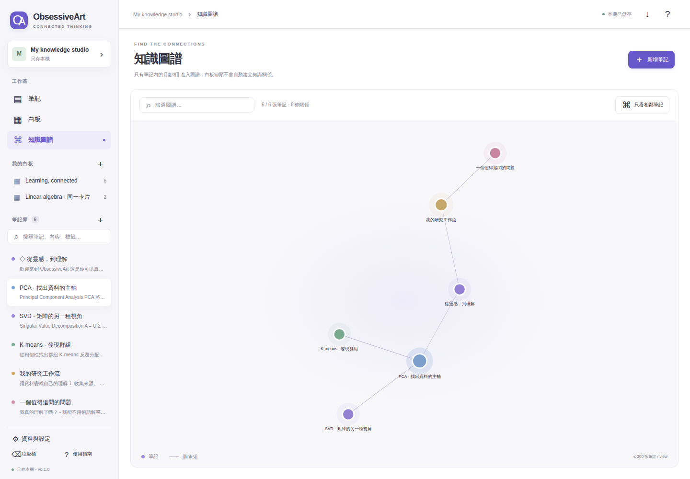
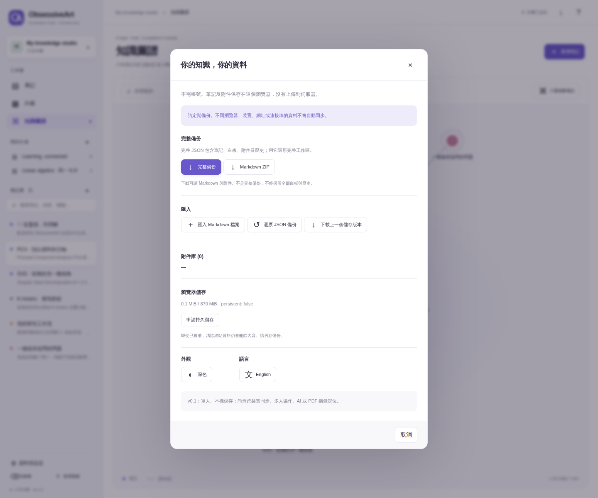
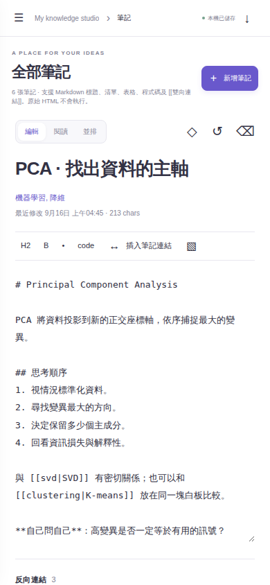

# ObsessiveArt

**筆記、白板、知識圖譜，共用同一份資料。**

[開啟網頁版](https://jacbus1.github.io/ObsessiveArt/) · [English](README.md) · [部署狀態](https://github.com/jacbus1/ObsessiveArt/actions/workflows/pages.yml) · [架構](docs/ARCHITECTURE.md) · [安全說明](SECURITY.md)

這是獨立實作的單人、本機優先知識工作區，借鏡 Obsidian、Miro、Heptabase 的工作流；與三者沒有隸屬關係，也不包含它們的專有程式碼。英文與繁體中文說明分開維護。

## 直接在瀏覽器使用

開啟 **[jacbus1.github.io/ObsessiveArt](https://jacbus1.github.io/ObsessiveArt/)**。不需要安裝、註冊帳號、API key 或外部資料庫。公開網站提供應用程式，每位使用者在自己的瀏覽器擁有獨立資料。

試用方式：雙擊示例 **PCA 卡片**，修改正文，再切換第二塊白板。你會看到同一份內容已更新，但兩塊白板的位置各自保留。重新整理可以檢查保存結果。存放重要內容之前，請先熟悉 **「資料與設定 → 完整備份」**。

初始示例使用繁體中文。介面可在 **「資料與設定 → 語言」** 切換；切換介面語言不會自動翻譯你的筆記。

## 功能圖文介紹

以下是 **實際 Chromium 瀏覽器截圖，不是概念設計圖**。截圖使用全新、用完即棄的瀏覽器環境及虛構示範內容，不包含私人筆記或帳戶資料。英文 README 使用另外一套英文截圖，本頁使用繁體中文介面。可核對 [截圖程式](tools/capture_readme.py) 及 [圖片來源與校驗碼](docs/screenshots/capture.json)。

### 白板：排列想法，不複製正文

拖動或調整卡片大小，平移與縮放白板，多選物件，加入便利貼、區段框及帶標籤箭頭。同一張筆記可放在多塊白板；從其中一塊移除位置，不會刪除原筆記。



### 筆記編輯器：編寫、閱讀、建立連結

使用 Markdown 編輯，或並排查看原文與預覽。加入標籤與內部連結，查看反向連結，以及目前筆記出現在哪些白板。透過插入筆記連結功能建立穩定 ID 連結，可以避免改名後連結失效。



### 知識圖譜：探索筆記之間真正的連結

圖譜來自筆記內的連結，不會把白板排版箭頭自動當成知識關係。可以按文字或標籤篩選、聚焦相鄰筆記，並點選節點開啟內容。每個視圖最多顯示 200 張筆記。



### 備份與還原：保留可攜的完整副本

完整 JSON 包含筆記、白板、附件與歷史。還原前，需要先下载並確認目前工作區的備份。Markdown ZIP 是可讀匯出，不是完整保真備份，不能代替 JSON。



### 手機尺寸編輯：在較窄畫面閱讀與編寫

介面會配合窄畫面調整。這張是 **390 × 844 的 Chromium 視窗**，並不代表已完成真實手機、Safari 或所有觸控操作驗收。



## v0.1.0 已實作功能

| 部分 | 功能 |
|---|---|
| 筆記 | Markdown 編輯／安全閱讀／並排、標籤、置頂、全文搜尋、雙向連結、反向連結、25 個編輯階段快照、垃圾桶及還原 |
| 白板 | 多塊白板、共用筆記位置、拖動／調整大小、平移／縮放、多選／框選、便利貼、區段框、帶標籤連線、圖片及 PDF 附件、結構操作復原／重做、SVG 匯出 |
| 圖譜 | 從筆記連結產生、文字／標籤篩選、相鄰節點及點選開啟筆記 |
| 資料 | IndexedDB 交易保存、過期寫入拒絕、上一個已存版本、完整 JSON 備份及還原、Markdown 匯入預覽、Markdown／附件 ZIP 匯出、離線應用快取 |
| 介面 | 英文／繁體中文、淺色／深色、響應式編輯 |

圖片可以顯示。PDF 附件可下載，但不會解析正文或高亮位置。Markdown 內的原始 HTML 不會執行。

## 在自己的電腦啟動

需要 Node.js 22 或以上：

```sh
git clone https://github.com/jacbus1/ObsessiveArt.git
cd ObsessiveArt
npm start
```

開啟 **http://localhost:4173**。不用 `npm install`，不要直接雙擊 `index.html`。以後請使用相同網址、連接埠及瀏覽器。

## 你的筆記仍然只在這個瀏覽器

發布網站或推送原始碼到 GitHub，**不會上傳或備份你的筆記**。目前沒有筆記上傳 API、分析追蹤、外部 CDN 執行時程式或 AI 呼叫，也沒有應用程式層的加密保護。

**瀏覽器儲存不是外部備份。** 清除網站資料、私密瀏覽、換瀏覽器／網域／連接埠，或裝置故障，都可能令內容無法取得。請定期下載完整 JSON，並確認檔案確實保存。由 localhost 搬到網頁版，需要明確匯出再還原。

同時開啟的舊分頁不能靜默覆蓋較新資料；發生衝突時會暫停儲存，請先下載未儲存內容再重新載入。這不是多人即時協作或跨裝置同步。

## 版本界線與上限

這是可使用的 **v0.1.0 單人版本**，不是完整複製三款產品，也不是企業級 production 認證。暫未實作帳號權限、多人協作、雲端同步、AI、OCR、自由手繪、完整 PDF 閱讀／高亮定位、任意富文字區塊，以及 Miro／Heptabase 無損匯入。

白板復原／重做只保留本次開啟期間的結構操作；開始文字編輯時會重設，避免舊快照覆蓋新正文。文字欄位使用瀏覽器原生撤銷，較早正文可用版本記錄還原。區段框移動時帶動完全位於框內的卡片，並非永久父子群組。

安全上限：5,000 筆記、150 白板、總共 5,000 白板物件、200 附件、每個附件 8 MiB、每則筆記 250,000 字元、正文與歷史合計 16 MiB、完整備份 40 MiB。**上限不代表已通過同規模效能測試。** 詳見 [版本說明](docs/RELEASE.md)。

## 測試與網站部署

```sh
npm run check
npm test
npm run build
# 另一個 Terminal 保持 npm start 執行：
python -m pip install playwright==1.57.0
python -m playwright install chromium
python tests/browser_test.py
# 重新拍攝 README 功能截圖：
python tools/capture_readme.py
```

CI 檢查語法、執行核心及安全測試、建置靜態網站，並使用真正的 Chromium 測試重新載入保存、拒絕過期寫入、備份還原及離線重開。請核對 [實際工作紀錄](https://github.com/jacbus1/ObsessiveArt/actions)，不要把設定存在當成已通過。

Pages 工作流程會在 main 收到相關應用程式或部署檔案更新後自動執行，也保留手動啟動。它先跑瀏覽器測試，再發布 `dist/`，最後經 HTTP 檢查公開網站的 HTML 及核心模組。這些發布後的 HTTP 檢查不等於針對公開網址執行完整瀏覽器測試。

自行 fork 時，首次在 **Settings → Pages → Source** 選擇 **GitHub Actions**。亦可把 `dist/` 放到其他 HTTPS 靜態主機。網站提供的是程式，每位使用者的資料仍在各自瀏覽器。

截圖工作流程只發布 `docs/screenshots/` 內的示例圖片及来源紀錄。功能圖不代表效能或安全認證。

更新離線快取前先儲存，關閉所有應用分頁後重開；不要為更新程式而清除網站資料。

## 授權

原創程式 MIT。沒有第三方執行時依賴或附送字型。GitHub Actions 與測試工具保留各自授權；詳見 [LICENSE](LICENSE) 及 [第三方聲明](THIRD_PARTY_NOTICES.md)。
